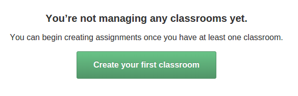
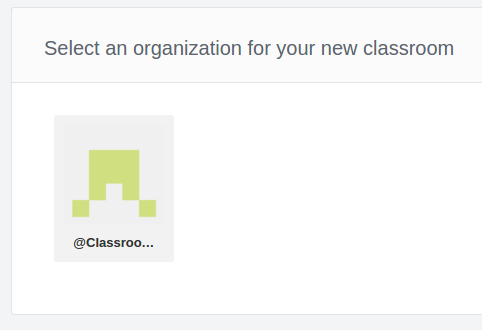
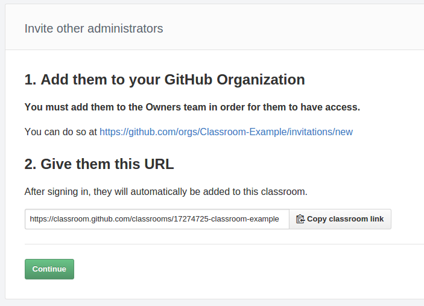

# Creando una clase

Tras loguearnos por primera vez podremos ver que la aplicacion nos indica que no hemos asignado aun ninguna clase, en caso contrario aparecerian las diferentes clases ya creadas. Clickeamos en crear nuestra primera clase.

El siguiente paso sera seleccionar la organizacion creada en el paso anterior de la guia. En el ejemplo solo se ve la creada para este tutorial, pero si el usuario tuviese mas organizaciones a su cargo aparecerian todas en la lista de seleccion. 

Tras seleccionar la organizacion es posible darle un titulo mas descriptivo que sera utilizado para uso interno en la aplicacion.

Si no es el unico profesor a cargo de esta clase, es posible añadir nuevos administradores dando permisos de propietario al nuevo profesor. Clickeando el link proporcionado por la aplicacion el nuevo profesor estara preparado para ser asignado en el sistema. 

