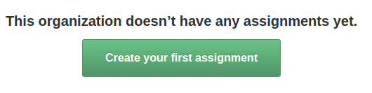
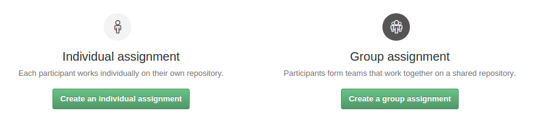
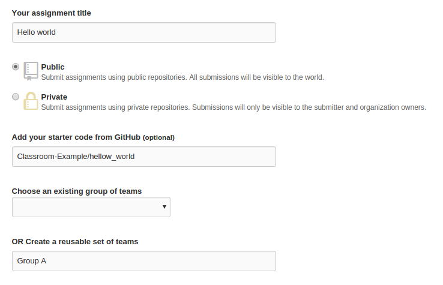

# Creating assignments

Tras loguearnos y seleccionar la clase con la que queremos trabajar, nos aparecera el menu de asignacion de tareas. Si el caso de que ya hemos creado alguna, aparecera para ser seleccionada para su uso, en este caso crearemos una tarea desde cero.

Las tareas podran ser asignadas a un unico alumno, o a un grupo de almnos pertenecientes a un grupo. Elegimos la opcion que mas nos convenga.

Habiendo seleccionado la opcion Group assignment. Veremos el siguiente menu, que solo diferira de la opcion individual en el apartado la no inclusion de un apartado de grupos.

Para la asignacion del trabajo es necesario primeramente un nombre de tarea y la seleccion del tipo de repositorio, ya sea privado o publico. Como podemos ver en el ejemplo se le ha asignado a la tarea un repositorio con un codigo inicial para que los alumnos comiencen a trabajar, siendo esta opcion opcional.

###La seleccion de grupos
Es posible seleccionar un grupo entre alumnos ya sido utilizado anteriormente, si se quiere crear un nuevo grupo su rellenara el cuadro de texto con el nombre y se aceptara la tarea.

