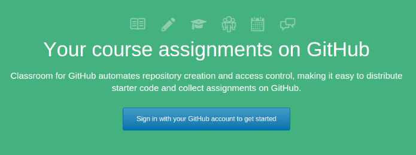

# User guide

###Firts Steps
Github Classroom es una aplicacion para la creacion y control de repositiorios de la plataforma Github. Asi pues, tanto el profesor como los alumnos intereseados en el uso de la aplicacion deben estar registrados como usuarios en [Github](https://github.com/).